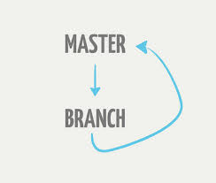
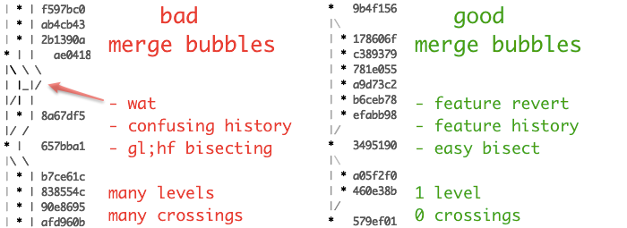

## A Git Branching Mdeol

### The gist

1. `master/main` must always be deployable.
1. **all changes** made through feature branches (pull-request + merge)
1. rebase to avoid/resolve conflicts; merge in to `master/main`

Or, as Zach Holman succinctly put it:
<div align=center>



</div>

### The workflow

```bash
# everything is happy and up-to-date in master
git checkout master
git pull origin master

# let's branch to make changes
git checkout -b my-new-feature

# go ahead, make changes now.
$EDITOR file

# commit your (incremental, atomic) changes
git add -p
git commit -m "my changes"

# keep abreast of other changes, to your feature branch or master.
# rebasing keeps our code working, merging easy, and history clean.
git fetch origin
git rebase origin/my-new-feature
git rebase origin/master

# optional: push your branch for discussion (pull-request)
#           you might do this many times as you develop.
git push origin my-new-feature

# optional: feel free to rebase within your feature branch at will.
#           ok to rebase after pushing if your team can handle it!
git rebase -i origin/master

# merge when done developing.
# --no-ff preserves feature history and easy full-feature reverts
# merge commits should not include changes; rebasing reconciles issues
# github takes care of this in a Pull-Request merge
git checkout master
git pull origin master
git merge --no-ff my-new-feature


# optional: tag important things, such as releases
git tag 1.0.0-RC1
```

### useful config

```bash
# autosetup rebase so that pulls rebase by default
git config --global branch.autosetuprebase always

# if you already have branches (made before `autosetuprebase always`)
git config branch.<branchname>.rebase true
```

### DOs and DON'Ts

No DO or DON'T is sacred. You'll obviously run into exceptions, and develop 
your own way of doing things. However, these are guidelines I've found
useful.

#### DOs

- **DO** keep `master` in working order.
- **DO** rebase your feature branches.
  - **DO** pull in (rebase on top of) changes
- **DO** tag releases
- **DO** push feature branches for discussion
- **DO** learn to rebase


#### DON'Ts

- **DON'T** merge in broken code.
- **DON'T** commit onto `master` directly.
  - **DON'T** hotfix onto master! use a feature branch.
- **DON'T** rebase `master`.
- **DON'T** merge with conflicts. handle conflicts upon rebasing.


### Links

- https://github.com/blog/1124-how-we-use-pull-requests-to-build-github


## FAQ


### Won't `git merge --no-ff` generate merge bubbles?

Yes. Merge bubbles aren't inherently bad. They allow you to revert entire
features at a time. They get confusing and annoying to deal with if they cross
(commits interleave), so don't do that.

<div align=center>



</div>

### What do you mean by "incremental, atomic" changes?

http://en.wikipedia.org/wiki/Atomic_commit#Atomic_Commit_Convention

Thanks wikipedia, I couldn't have put it better myself.


### Why not [gitflow](http://nvie.com/git-model/) or another complex workflow?

Be my guest. I've used gitflow and other similar models.After working in various teams, this is just what I've come to use. But next time you have to ask someone whether it is okay to push or pull from this or that branch.


### But, is it [web-scale](http://mongodb-is-web-scale.com/)?

Friends claim more complex models are necessary for scaling large teams,
maintaining old releases, controlling information flow, etc. It very well may
be that using multiple mainlines (e.g. `develop`, `stable`, `release`, `v2`,
`tested`, etc) is exactly what fits your organization's constraints. That's
for you to decide, not me (unless we work together -- oh hi there!).

But you always have to wonder, "shouldn't I use tags for that"? For example,
tracking releases on a branch is a bit silly. A release commit can be tagged.
You can checkout a tag, just like any branch, or any commit, and do
whatever it is you need to do.

My guess is this relationship holds:

<div align=center>


</div>

So, perhaps taking five minutes to teach your team how to use `checkout` and
`tag` might save you more than 15% on car insurance.


## GitHub notes


### Don't fork. Push feature branches to main repo.

Sometimes I see people forking repositories in order to issue pull-requests.
Yes, you may have to do this when contributing to open-source projects you 
don't regularly contribute to. But, if you are a contributor, or working in the 
same org, get push rights on the repo and push all your feature branches to it. 
**Issue pull requests from one branch to another within the same repo.**


### Should I merge Pull Requests on the site or commandline?

Up to you. Github does `git merge --no-ff` so that the commit message indicates
the pull request number. This is useful information to have, don't just throw
away history for the sake of it. You never know what will be useful to look at
in the future.