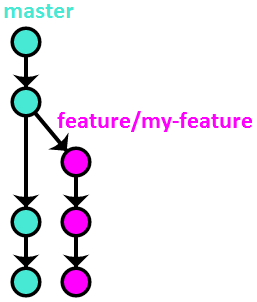
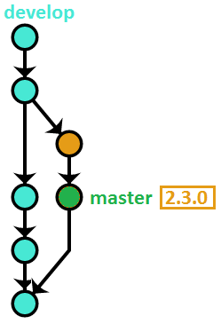

# Git Oneflow

## Introduction 

OneFlow has been conceived as a simpler alternative to GitFlow. However, please don’t read “simpler” as “less able”. OneFlow’s branching model is exactly as powerful as GitFlow’s. There is not a single thing that can be done using GitFlow that can’t be achieved (in a simpler way) with OneFlow. The description below goes into more detail.

As the name suggests, OneFlow’s basic premise is to have one eternal branch in your repository. This brings a number of advantages (see below) without losing any expressivity of the branching model – the more advanced use cases are made possible through the usage of Git tags.

While the workflow advocates having one long-lived branch, that doesn’t mean there aren’t other branches involved when using it. On the contrary, the branching model encourages using a variety of support branches (see below for the details). What is important, though, is that they are meant to be short-lived, and their main purpose is to facilitate code sharing and act as a backup. The history is always based on the one infinite lifetime branch.

## OneFlow advantages

Maintaining a single long-lived branch simplifies the versioning scheme and day-to-day operations that developers have to perform considerably.

It also makes the project history cleaner and more readable, and thus more useful.

## When to use OneFlow

OneFlow is meant to be a drop-in replacement for GitFlow, which means it’s suitable in all situations that GitFlow is. In fact, you can quite easily migrate a project that is using GitFlow to OneFlow.

The main condition that needs to be satisfied in order to use OneFlow for a project is that every new production release is based on the previous release (GitFlow has exactly the same requirement). The vast majority of software projects fulfill that condition. If your project is a web application, for instance, then OneFlow should be a great fit. Most open-source projects could be versioned using OneFlow as well.

## When NOT to use OneFlow
While OneFlow is pretty flexible, it’s not suitable for every project. OneFlow will be a bad fit in basically the same circumstances that GitFlow would be. There are 2 main reasons why that might be the case.

First, when the above condition (“every new production release is based on the previous one”) is not satisfied. As an example, take the Python programming language. It has two incompatible versions, 2 and 3. Both of them receive bugfixes and security patches – however, that doesn’t mean a new release of Python 3 is based on the commit of the latest release of Python 2. The two versions have diverged, and while they surely share a lot of code, you can’t say that one is based on the other (talking from a purely version control perspective).

If your project needs to maintain multiple simultaneous yet incompatible release versions that way, then OneFlow won’t work for you out of the box. You can surely use elements of it – probably each individual version can be managed using OneFlow, for example. However, in these types of projects, the main challenge is usually in the interactions between the versions and how to effectively share code between them, and OneFlow was not designed to be a solution to that problem.

Second, if your project has a high degree of automation – uses Continuous Delivery, or even Continuous Deployment, for example – then this workflow will most likely be too heavy for you. Perhaps parts of it might still be useful, but other elements (like the release process, for instance) would have to be heavily modified to make sense when releasing on such a very frequent cadence.

## Detailed description

### The main branch
Like was explained before, the workflow uses only one eternal branch. The name doesn’t matter, and can be anything you want. We will use `master\main` in this description, as it’s probably the most common name, and is already a Git convention, but you can also use, for example, `current`, `default`, `mainline`, or anything else.

### Feature Branches
Feature branches (also sometimes called topic branches) are where the day-to-day development work happens – hence, they are by far the most common of all the support branches. They are used to develop new features and bugfixes for the upcoming release. They are usually named similarly to feature/my-feature.

<div align=center>



</div>

Feature branches often exist only in the developer’s repository, and are never pushed – however, if there are multiple people working on one feature, or if the feature will take a long time to develop, it’s typical to push them to the central repository (if only to make sure the code isn’t lost with a single disk failure).

### Starting a feature branch

To start a feature branch, simply create a new branch from `master`:

```sh
$ git checkout -b feature/my-feature master
```

## Finishing a feature branch
Once work on the given feature is done, it needs to be integrated back into `master`. There are several ways this can be accomplished.

Note: the choice of the feature branch integration method is immaterial as far as the workflow is concerned. It should be based on personal or team preference, however the branching model will work exactly the same, regardless of which option is chosen. My personal recommendation is to use option #1.

## Option #1 - `rebase`

This method uses Git’s `rebase` command (with the `-i`, meaning interactive, switch) to integrate the feature branch with `master`.

```sh
$ git checkout feature/my-feature

$ git rebase -i master

$ git checkout master

$ git merge --ff-only feature/my-feature

$ git push origin master

$ git branch -d feature/my-feature
```

If you’re not yet well acquainted with the rebase command, I recommend [this chapter](https://git-scm.com/book/en/v2/Git-Tools-Rewriting-History) from the Pro Git SCM book.


Here’s a visual illustration of how that method works:

<div align=center>


</div>

**Advantages of this method:**

- Rebasing before integrating with `master` allows you to clean up the branch history before making it public, resulting in better final history landing on `master`.

- Linear history makes things simpler and easier to find, especially when looking at the per-file history.

**Disadvantages:**

- Reverting the entire feature requires reverting multiple commits.


## Option #2 - `merger -no-ff`

This is the method that GitFlow advocates.

```sh

$ git checkout master
$ git merge --no-ff feature/my-feature
$ git push origin master
$ git branch -d feature/my-feature
```

Visually:

<div align=center>


</div>

**Advantages of this method:**

- Reverting the entire feature requires reverting only one commit (the merge commit).

**Disadvantages:**

- The feature branch history, which is often messy, gets put directly on `master`.

- The proliferation of merge commits (especially as the number of developers on a project grows) makes the history unmanageable.


## Option #3 - `rebase` + `merge -no-ff`

This method is a combination of the previous two, trying to keep their advantages while simultaneously getting rid of the disadvantages:

```sh
$ git checkout feature/my-feature

$ git rebase -i master

$ git checkout master

$ git merge --no-ff feature/my-feature

$ git push origin master

$ git branch -d feature/my-feature

```

Visually:

<div align=center>


</div>

**Advantages of this method:**

- Clean and almost linear history.
- Easy to revert an entire feature with one commit.

**Disadvantages:**

- It’s difficult to enforce this method programmatically, so it has to rely on best-effort convention.

Finally, regardless of the method used, if the feature branch was pushed to the central repository, you need to now remove it:


```sh
$ git push origin :feature/my-feature
```

## Release branches

Release branches are created to prepare the software for being released. Obviously, what exactly that means varies on a project-per-project basis. This could be as simple as bumping the version number in the configuration, or involve things like code freezes, producing Release Candidates, and having a full QA process. The important thing is all that happens on a separate branch, so that day-to-day development can continue as usual on `master`.

The naming convention for these is `release/<version-number>`.

## Starting a release branch

Release branches also start from master, however they often don’t start from the tip – instead, they have their origin in whatever commit on master you think contains all of the features that you want to include in the given release.

For example, here we start the branch for the version `2.3.0` release on a commit with the hash `9efc5d`:

```sh
$ git checkout -b release/2.3.0 9efc5d
```

## Finishing a release branch
Once whatever process you use for releasing is finished, the tip of the branch is tagged with the version number. After that, the branch needs to be merged into `master` to be versioned permanently:

```sh
$ git checkout release/2.3.0

$ git tag 2.3.0

$ git checkout master

$ git merge release/2.3.0

$ git push --tags origin master

$ git branch -d release/2.3.0
```

Here’s a diagram illustrating the above commands (assuming the release took two commits):

<div align=center>


</div>

Again, if you pushed the release branch to the central repository, you now need to delete it:

```sh
$ git push origin :release/2.3.0
```

## Hotfix branches

Hotfix branches are very similar to release branches – they result in a new version of the project being released. Where they differ is their intentions – while release branches signify a planned production milestone, hotfix branches are most often an unwanted but necessary exception to the usual release cadence, typically because of some critical defect found in the latest release that needs to be fixed as soon as possible.

They are named `hotfix/<version-number>`. Note that if you use [Semantic Versioning](http://semver.org/http://semver.org/), regular releases bump either the Major or Minor number, while hotfixes bump the Patch number.

Starting a hotfix branch
Hotfix branches are cut from the commit that the latest version tag points to. Continuing our example from the release branch:

```sh
$ git checkout -b hotfix/2.3.1 2.3.0
```

## Finishing a hotfix branch

Finishing a hotfix branch is pretty much the same as finishing a release branch: tag the tip, merge it to `master`, then delete the branch.

```sh
$ git checkout hotfix/2.3.1

$ git tag 2.3.1

$ git checkout master

$ git merge hotfix/2.3.1

$ git push --tags origin master

$ git branch -d hotfix/2.3.1
```

Here’s a visual illustration:

<div align=center>


</div>

There is one special case when finishing a hotfix branch. If a release branch has already been cut in preparation for the next release before the hotfix was finished, you need to merge the hotfix branch not to `master`, but to the release branch. Otherwise, the new release will bring back the original bug that the hotfix corrected. The fix will eventually get to `master` – when the release branch is merged back to it.

As always, if the hotfix branch was pushed to the central repository, you need to remove it now:

```sh
$ git push origin :hotfix/2.3.1
```

# # Variation – `develop` + `master`
There is one small wrinkle with the branching model described above. In order to find the latest production version of the code, you need to look at all of the tags in the repository, and checkout the latest one.

This problem has a very simple solution. You add another, ‘latest’, long-lived branch, whose only purpose is to point to the last released commit. Each time the version number is bumped, the ‘latest’ branch is fast-forwarded to the newly created tag.

So, that’s all great, but there is one small issue left. It would be very cool, especially for open-source projects, if the default branch that people got when cloning the repository was this ‘latest’ branch, which contains stable code, instead of the ‘working’ (what was called `master` in the above description) branch, which contains the work-in-progress on the yet-unreleased next version, which might not be very stable.

The simplest solution to this problem is to take advantage of the fact that `master` is the default branch in Git. So, we call the ‘latest’ branch `master`. However, that means we need to find a new name for the ‘working’ branch. In this description, we will re-use the GitFlow convention, and call it `develop` (of course, you are free to call it whatever you want in your project).

For clarity, I will show all of the workflow operations again, this time using this new naming. However, I want to emphasize that, other than a slight name change and the introduction of a new ‘marker’ branch, the workflow is exactly the same as was described above.

## The main branches

This variation uses two branches: `develop`, which plays the same role as `master` above, and `master`, which points at the latest release tag.

## Feature branches

Feature branches work exactly the same as already explained, except you need to substitute `master` with `develop` in the description above.

###  Starting a feature branch
```sh
$ git checkout -b feature/my-feature develop
```

### Finishing a feature branch

**Option #1 – `rebase`**
```sh
$ git checkout feature/my-feature

$ git rebase -i develop

$ git checkout develop

$ git merge --ff-only feature/my-feature

$ git push origin develop

$ git branch -d feature/my-feature
```

**Option #2 – `merge –no-ff`**
```sh
$ git checkout develop

$ git merge --no-ff feature/my-feature

$ git push origin develop

$ git branch -d feature/my-feature
```

**Option #3 – `rebase` + `merge –no–ff`**
```sh
$ git checkout feature/my-feature

$ git rebase -i develop

$ git checkout develop

$ git merge --no-ff feature/my-feature

$ git push origin develop

$ git branch -d feature/my-feature
```
## Release branches

Release branches work the same as described above (with `master` substituted for `develop`, of course), except one small detail. There is an extra step when finishing the release branch: fast-forwarding the marker branch to the newly created release `tag`.

### Starting a release branch
```sh
$ git checkout -b release/2.3.0 9efc5d
```

### Finishing a release branch
```sh
$ git checkout release/2.3.0

$ git tag 2.3.0

$ git checkout develop

$ git merge release/2.3.0

$ git push --tags origin develop

$ git branch -d release/2.3.0
```

And here is the extra step – fast-forwarding `master` to the latest release tag:

```sh
$ git checkout master

$ git merge --ff-only 2.3.0

$ git push origin master
```

Here’s a visualization of the state of the repository after finishing the release branch:

<div align=center>



</div>

## Hotfix branches

Hotfix branches, because they result in publishing a new version as well, also require the additional step of fast-forwarding `master` to the newly created `tag`.

### Starting a hotfix branch

Because `master` always tracks the latest tag, creating a `hotfix` branch is a tiny bit easier in this variant (note however that you still need to look at the tags to determine what the previous version number was, in order to name your `hotfix` branch correctly):

```sh
$ git checkout -b hotfix/2.3.1 `master`
```

### Finishing a hotfix branch
```sh
$ git checkout hotfix/2.3.1

$ git tag 2.3.1

$ git checkout develop

$ git merge hotfix/2.3.1

$ git push --tags origin develop

$ git branch -d hotfix/2.3.1
```

And here is the additional step of fast-forwarding `master` to the latest release `tag`:

```sh
$ git checkout master

$ git merge --ff-only 2.3.1

$ git push origin master
```

If we continue our release example, the visual illustration looks something

<div align=center>


</div>