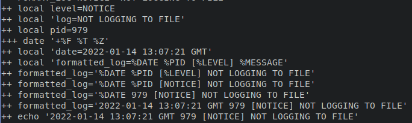
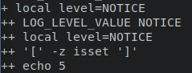
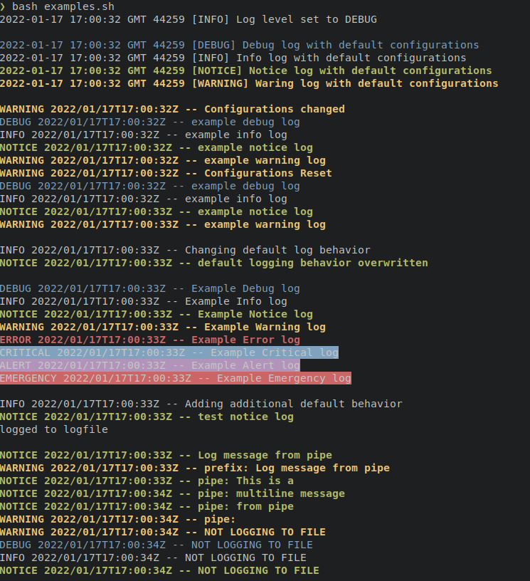

# Introduction 

In this lab you will implement the Internet Engineering Taskforce RFC 5424 standard for syslog using ```bash```. You can just blind copy the code and place them in descending order into your script, but remember to read around each code block so you understand it.

> **NOTICE**
>
> Be prepared to see a more advanced level of bash scripting through this exercise, as this is a stage 6 module you are expected to learn at higher level.
>
> Also, this lab is essential for the first assignment.
>
> Once you have followed this document you will be provided with a file that you can then test the output of the script.

# Getting Started 

Open a terminal and make a directory in your `$HOME` directory and call it `AOS/` if you havent got one already,
using the `mkdir AOS` command in the terminal in JupyterHub.

Next you will need to create a child directory inside `AOS` called `logging`.

From here you can either navigate to this newly created child directory using `cd AOS/logging` if you are in the `$HOME` directory still.


Now pick your favourite text editor(nano, vim, etc) or find an IDE installed on the system. Then create a new shell script like this `<editor> rfclogger.sh` where the `<editor>` is nano, vim, etc.

At the top we need a sha-bang to point the location of the bash compiler.

```bash
#! /usr/bin/env bash
# Fail on first error
set -e
```

This may be the first time you have seen `set`, a *builtin*. Essentially, lets you set or unset values of shell options and positional parameters, in this instance we are seting the parameter as `-e` which means exit immediately if a command exits with a non-zero status.

> WANT TO KNOW MORE
>
> You can always view the help or manual page in the terminal command line) by either:
>
> -   `man <cmd>`
>
> -   `<cmd> <--help || -h >`
>
> -   For instance `set --help`


# Configurables

A quick reminder here that `#` is a comment for one line. This bit is essential for running the script but it may help if you come to revisit at a later date.

```bash
#--------------------------------------------------------------------------------------------------
# Configurables

# RFC-5424 log levels
# -------------------
# DEBUG: Detailed debug information.
# INFO: Interesting events
# NOTICE: Normal but significant events.
# WARNING: Exceptional occurrences that are not errors
# ERROR: Runtime errors that do not require immediate action but
#        should typically be logged and monitored.
# CRITICAL: Critical conditions.
# ALERT: Action must be taken immediately.
# EMERGENCY: Emergency: System is unusable.
#
# An additional level OFF is added.
# When log level set to OFF no more messages are logged to the console
```

However, the following code is needed.

```bash

declare -A LOG_LEVELS
export LOG_LEVELS=([OFF]=8 [DEBUG]=7 [INFO]=6 [NOTICE]=5 [WARNING]=4
		   [ERROR]=3 [CRITICAL]=2 [ALERT]=1 [EMERGENCY]=0)
# Make sure that HOME exist
export HOME=${HOME:-$(getent passwd "$(whoami)" | cut -d: -f6)}

# Default formats
export DEF_LOG_FORMAT='%DATE %PID [%LEVEL] %MESSAGE'
# ISO 8601
export DEF_LOG_DATE_FORMAT='+%F %T %Z'
```

A few things to note,

-   `decalre` is a shell BUILTIN that allows the programmer to declare  variables and give them attributes. The option which sets the attribute is `-A` and makes the `LOG_LEVELS` variable an associative arrays. Where an associative array variable is used to store multiple data with index and the value of each array element is accessed by the corresponding index value of that element.

-   All global variables are in UPPERCASE, and as we will see later `local` variables are lowercase

-   `export` is a BUILTIN command of the bash shell and other Bourne shell variants. It is used to mark a shell variable for export to child processes.

> **WANT TO KNOW MORE**
>
> Experiment with `getent`in a new terminal type the following:
>
> -   `getent passwd "$(whoami)"`

> What does it return? If you are unsure research to find out what the returned value(s) mean, then do the final part of the command:
>
> -   `getent passwd "$(whoami)" | cut -d: -f6`
>
> Do you understand how, if not research it?


## Function for Log Variables 

We are going to make our first function for this script.

```bash
# Define LOG variables
LOG_VARS() {
    export LOG_LOGFILE_ENABLE=${LOG_LOGFILE_ENABLE:-1}  # Enable logging to file
    export LOGFILE=${LOGFILE:-"$HOME/tmp/bash-logger/my-bash-logger.log"}
    export LOG_FORMAT=${LOG_FORMAT:-$DEF_LOG_FORMAT}
    export LOG_DATE_FORMAT=${LOG_DATE_FORMAT:-$DEF_LOG_DATE_FORMAT} #Eg:2014-09-07 21:51:57
    export LOG_COLOR_ENABLE=${LOG_COLOR_ENABLE:-1}  # Enable colors by default
    export LOG_LEVEL=${LOG_LEVEL:-${LOG_LEVELS[DEBUG]}} # Logs all messages to the terminal
    export LOG_COLOR_DEBUG=${LOG_COLOR_DEBUG:-"\033[0;34m"} # Blue
    export LOG_COLOR_INFO=${LOG_COLOR_INFO:-"\033[0;37m"}  # White
    export LOG_COLOR_NOTICE=${LOG_COLOR_NOTICE:-"\033[1;32m"} # Green
    export LOG_COLOR_WARNING=${LOG_COLOR_WARNING:-"\033[1;33m"} # Yellow
    export LOG_COLOR_ERROR=${LOG_COLOR_ERROR:-"\033[1;31m"}  # Red
    export LOG_COLOR_CRITICAL=${LOG_COLOR_CRITICAL:-"\033[44m"} # Blue Background
    export LOG_COLOR_ALERT=${LOG_COLOR_ALERT:-"\033[45m"} # Purple Background
    export LOG_COLOR_EMERGENCY=${LOG_COLOR_EMERGENCY:-"\033[41m"} # Red Background
    export RESET_COLOR=${RESET_COLOR:-"\033[0m"}
}

# Set LOG variables
LOG_VARS
```
-   Bash colours(colors) are implemented when used in conjunction with
    octal/ANSI escape codes `\033[0;34m`, see <https://www.shellhacks.com/bash-colors/> for further explanation.

-   If a variable isn't set earlier on or later by some other process of the user bash lets you apply a default value in case of this: So, if the `LOGFILE` is not initialised then `LOGFILE:-"$HOME/tmp/bash-logger/my-bash-logger.log"` will apply the default  log file path location as `$HOME/tmp/bash-logger/my-bash-logger.log`.

-   The last line here, `LOG_VARS` is how we call a function in a bash script

# Individual Log Functions

Now we are going to be creating the 8 of the syslog logging levels with
an additional 1 to turnoff logging:

| OFF  | ERROR  |  CRITICAL |
| DEBUG   | INFO  |  ALERT |
| NOTICE  |  WARNING |  EMERGENCY |

```bash
#----------------------------------------------------------------------------------------
# Individual Log Functions
# These can be overwritten to provide custom behavior for different log levels

OFF()       { LOG_HANDLER_DEFAULT "$FUNCNAME" "$@"; }
DEBUG()     { LOG_HANDLER_DEFAULT "$FUNCNAME" "$@"; }
INFO()      { LOG_HANDLER_DEFAULT "$FUNCNAME" "$@"; }
NOTICE()    { LOG_HANDLER_DEFAULT "$FUNCNAME" "$@"; }
WARNING()   { LOG_HANDLER_DEFAULT "$FUNCNAME" "$@"; }
ERROR()     { LOG_HANDLER_DEFAULT "$FUNCNAME" "$@"; exit 1; }
CRITICAL()  { LOG_HANDLER_DEFAULT "$FUNCNAME" "$@"; exit 1; }
ALERT()     { LOG_HANDLER_DEFAULT "$FUNCNAME" "$@"; exit 1; }
EMERGENCY() { LOG_HANDLER_DEFAULT "$FUNCNAME" "$@"; exit 1; }
```

So again probably some new syntax and commands are standing out.

-   `$FUNCNAME` contains the names of shell functions on the execution call stack, it can store an array of functions.

-   `$@` expands into a list of separate parameters, where as `$*` is one  parameter consisting of all the parameters added together.

-   Hopefully you remember from other content you have learned at CCCU that `exit 0` and is explicit means no error, exit 1 is an error and is implicit.

# Helper Functions

Here the we will have some helper functions to that include the actual log function and level and level name.

Instead of showing it all in one dump, we will do each one individually.
```bash
#-------------------------------------------------------------------------------------------
# Helper Functions

# Outputs a log formatted using the LOG_FORMAT and DATE_FORMAT configurables
# Usage: FORMAT_LOG <log level> <log message>
# Eg: FORMAT_LOG CRITICAL "My critical log"
FORMAT_LOG() {
    local level="$1"
    local log="$2"
    local pid=$$
    local date="$(date "$LOG_DATE_FORMAT")"
    local formatted_log="$LOG_FORMAT"
    formatted_log="${formatted_log/'%MESSAGE'/$log}"
    formatted_log="${formatted_log/'%LEVEL'/$level}"
    formatted_log="${formatted_log/'%PID'/$pid}"
    formatted_log="${formatted_log/'%DATE'/$date}" 
    echo "$formatted_log"
}
```

So the above code sets out how we want the log format to look like,`see the third line of code above` gives an example of usage. Below you can see the output on the
terminal when the `bash` is passed the `-x` option, like debugging.



For example the above shows the output of ```FORMAT_LOG``` when the script is called using ```bash -x ./rfclogger.sh```

```bash
# Calls one of the individual log functions
# Usage: LOG <log level> <log message>
# Eg: LOG INFO "My info log"
LOG() {
    local level="$1"
    local log="$2"
    local log_function_name="${level^^}"
    $log_function_name "$log"
}
```

Only special functionality is the special characters on line `7` of the above code, `"...${level^^}"` where the caret symbols `^^` is shorthand for force to UPPERCASE the value in the variable `level`.

```bash
# Get the level value from level name
# Eg: LOG_LEVEL_VALUE <DEBUG | INFO | ...>
LOG_LEVEL_VALUE() {
    local level="${1}"
    [ -z "${LOG_LEVELS[$level]+isset}" ] && return 1
    echo "${LOG_LEVELS[$level]}"
}
```

Only thing really to point out here is that `-z` checks to see if something is of length **zero**. The function `isset` checks checks whether a variable is set, which means that it has to be declared and is **not** NULL. Therefore, we can set value by default to `LOG_LEVELS` if the current `level` variable is NULL.



Again output shown when called with ```bash -x```

Next you are going to create function that gets the log name from the supplied numeric value.

```bash
# Get log level name from numeric value.
# Eg: LOG_LEVEL_NAME <0..7>
LOG_LEVEL_NAME() {
    local level=""
    local value="${1}"
    for level in "${!LOG_LEVELS[@]}"; do
       [ "${LOG_LEVELS[$level]}" -eq "${value}" ] && echo "${level}" && return 0
    done
    return 1
}
```
# Log Handlers

We are almost there we a several more functions to write, some that are styling/formatting for colour capable terminals.

```bash
#------------------------------------------------------------------------------------------
# Log Handlers

# All log levels call this handler (by default...)
# logging behavior
# Usage: LOG_HANDLER_DEFAULT <log level> <log message>
# Eg: LOG_HANDLER_DEFAULT DEBUG "My debug log"
LOG_HANDLER_DEFAULT() {
    # From pipe
    if [ -p /dev/stdin ]; then
        local level="$1"
        shift
        while read -r line; do
            args=()
            if [ -n "$*" ]; then
                args+=( "$@" )
            fi
            args+=( "${line}" );
            LOG_HANDLER_OUT "$level" "${args[*]}"
        done
    # Normal log
    else
        LOG_HANDLER_OUT "$@"
    fi
}
```

There appears to be a fair amount going on here, but rest assured the structure of the code and commands used therein are pretty much self explanatory. But as always here is an explanation for each key point.

-    the line with the ``if`` condition, `-p` is the the flag for pipe and is checking for a piped  instance in stdin. A note here `/dev/stdin` is unique because it is a symbolic link to `/proc/self/fd/0` and `/proc/self` is a symbolic link only seen by your running  process to its process-id. The `/proc` filesystem is a virtual (not real) file system which has the ability to show a different view to each process.

-   `shift` is a BUILTIN command of the Bash shell. When executed, it shifts the positional parameters (such as arguments passed to a bash script) to the left, putting each parameter in a lower position.

-   the next ``if`` condition checks to see if all arguments are **not**, `-n`, empty.

Below you will see an the output of the `if` statement in action.


So now we have a function that will handle for colour (color) and non-colour (color) terminals. You can see that a check is made on the first `if` condition where `-eq` means equals and it is used for numerical comparison.

```bash
# Used by LOG_HANDLER_DEFAULT to output the log
LOG_HANDLER_OUT(){
    local level="$1"
    local formatted_log="$(FORMAT_LOG "$@")"
    if [ "${LOG_COLOR_ENABLE}" -eq "1" ]; then
            LOG_HANDLER_COLORTERM "$level" "$formatted_log"
    else
            LOG_HANDLER_TERM "$level" "$formatted_log"
    fi

    if [ "${LOG_LOGFILE_ENABLE}" -eq "1" ]; then
        LOG_HANDLER_LOGFILE "$level" "$formatted_log"
    fi
}
```

There is also a check for sending the log to a file on the filnal `if` statement.

The below code provides the functionality to match the level of logging to the colours defined correct colour.

```bash
# Outputs a log to the stdout, colourised using the LOG_COLOR configurables
# Usage: LOG_HANDLER_COLORTERM <log level> <log message>
# Eg: LOG_HANDLER_COLORTERM CRITICAL "My critical log"
LOG_HANDLER_COLORTERM() {
    local level="$1"
    local level_value="$(LOG_LEVEL_VALUE "$level")"
    local log="$2"
    local color_variable="LOG_COLOR_$level"
    local color="${!color_variable}"
    log="$color$log$RESET_COLOR"

    [ "${LOG_LEVEL}" -eq "${LOG_LEVELS[OFF]}" ] && return 0
    [ "${level_value}" -gt "$LOG_LEVEL" ] && return 0
    echo -e "$log"
}
```

What we see from the above is that the log message is preceded by a colour and then at the end of the log message colour is returned to default, achieved by line with `og="$color$log$RESET_COLOR"`.

Furthermore, line with the code `[ "${LOG_LEVEL}" -eq "${LOG_LEVELS[OFF]}" ] &&return 0` performs a numerical comparison on the current `LOG_LEVEL`
to see if it matches the value OFF(8).

So we have four functions left...

Continuing with the handler theme, the next function is the `LOG_HANDLER_TERM`, essentially the same as the the `LOG_HANDLER_COLORTERM` but without the colour!

```bash
# Outputs a log to the stdout, without color
# Usage: LOG_HANDLER_TERM <log level> <log message>
# Eg: LOG_HANDLER_TERM CRITICAL "My critical log"
LOG_HANDLER_TERM() {
    local level="$1"
    local level_value="$(LOG_LEVEL_VALUE "$level")"
    local log="$2"

    [ "${LOG_LEVEL}" -eq "${LOG_LEVELS[OFF]}" ] && return 0
    [ "${level_value}" -gt "$LOG_LEVEL" ] && return 0
    echo -e "$log"
}
```

Next function is the deals with the log file itself. Although line `locallevel="$1"` is not used, it is good to store the argument for future use...

```bash
# Appends a log to the configured logfile
# Usage: LOG_HANDLER_LOGFILE <log level> <log message>
# Eg: LOG_HANDLER_LOGFILE NOTICE "My critical log"
LOG_HANDLER_LOGFILE() {
    local level="$1"
    local log="$2"
    local log_path="$(dirname "$LOGFILE")"
    [ -d "$log_path" ] || mkdir -p "$log_path"
    echo "$log" >> "$LOGFILE"
    LOG_ROTATION
}
```

Main things here are the checking if the file exists and if not create it as seen in lines `[ -d "$log_path" ] || mkdir -p "$log_path"`. Once the file and the message has been logged(line `echo"$log" >> "$LOGFILE"`) then the system will check to see if a rotation of logs is needed by calling the `LOG_ROTATION` function.

The `LOG_ROTATION` function will rotate the logs every 500 lines, you could modify this to change the value, line `if [[  ${log_size} -gt 500 ]];then`. 

```bash
# Rotates logs if current log is over 500 lines
LOG_ROTATION(){
    local log_size=$(wc -l $LOGFILE | awk '{print $1}')
    local count_log_files=$(ls ${LOGFILE%/*} | grep "${LOGFILE##/*}.*.gz" | wc -l )
    if [[ ${log_size} -gt 500 ]]; then
        if [ ${count_log_files} -gt 0 ]; then
            for ((i=${count_log_files}; i!=0; i--)); do
		            local n=$((${i}+1))
                    mv ${LOGFILE}.${i}.gz ${LOGFILE}.${n}.gz
            done
        fi
        gzip -c "${LOGFILE}" > "${LOGFILE}.1.gz"
        echo "" > ${LOGFILE}
   fi
}
```

Some explanation will be given for lines ` local count_log_files=$(ls ${LOGFILE%/*} | grep "${LOGFILE##/*}.*.gz" | wc -l )` and `for ((i=${count_log_files}; i!=0; i--)); do`, the rest is self explanatory.

Line `local count_log_files=$(ls ${LOGFILE%/*} | grep "${LOGFILE##/*}.*.gz" | wc -l )` counts the number of files in the directory. First `ls` is passed the `LOGFILE` where only the directory remains `%/*`, then piped `|` into ```grep``` that the only looks for files that are `my-bash-logger.log.#.gz` where `#` is a number, this intern is piped to `wc` and the option `-l` will return the number of instances. 

Line `for ((i=${count_log_files}; i!=0; i--)); do`, is a for loop in bash, this is one of several formats, we then decrement the total number of instances of a ```...*.gz``` files and then increment the actual file, (rotating).

Lastly, this final function, `unsets` all these `env` variables when called by the user.

```bash
# Reset log variables to default values
LOG_RESET() {
    unset LOGFILE
    unset LOG_FORMAT
    unset LOG_DATE_FORMAT
    unset LOG_COLOR_ENABLE
    unset LOG_LEVEL
    unset LOG_COLOR_DEBUG
    unset LOG_COLOR_INFO
    unset LOG_COLOR_NOTICE
    unset LOG_COLOR_WARNING
    unset LOG_COLOR_ERROR
    unset LOG_COLOR_CRITICAL
    unset LOG_COLOR_ALERT
    unset LOG_COLOR_EMERGENCY
    unset RESET_COLOR

    LOG_VARS
}
```

> **WANT TO KNOW MORE**
>
> Now that you have been through this document you can use the `example.sh` script to test the functionality of the ```rfclogger.sh```.
>
> 

