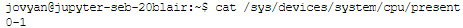

# Introduction

So like last week we are going to keep adding to our script we created
using on JupyterHub.

>**NOTICE**
>
> Jupyterhub link here: <https://jupyterhub.canterbury.ac.uk/>
>
>1.   Sign in with your CCCU Microsoft account.
>
>2.  In launcher menu click Terminal and Bash
>
>3.  Once in terminal mode, either make a directory () called 'AOS' or  navigate to it if you did this last
time ().
>
>4.   Now create a file called with by writing into the terminal , if you  already have a from last week do
>the following and then .
>
> If you want to find more information about each command used, either use the ```man <cmd>``` or go to <https://man7.org/linux/man-pages/> and search for them here.

# Script Header

Once completed the script should output the following information to the terminal, as seen in below. Notice the run the script we use the ```bash /path/to/script <options>``` format.


First of make sure your file looks like code shown below.

```bash
#! /usr/bin/env bash
# CREATED BY: Name
# Date created: todays
# Version 0.1
# this script is designed to gather system statistics
```

In shell scripting comments, where the compiler ignores these lines, is defined as ```#```. The first line is special as it points to the directive of the interpreter for the scripting language you are using, in this case ```bash```. We call the ```!#```  a hash-bang, shebang, hash-pling etc. The idea is it makes the shell script more like an executable file.

# Global Variables

Next we are going to define some variables, in bash all variables are, unless you specify that they are by defualt, **global**. Using the convention that **global** variables are defined as **UPPERCASE**. Incontrast **local** variables are defined using the self title keyword ```local``` and are written in **lowercase**.

```bash
AUTHOR="Seb"
VERSION="0.1"
RELEASED="2022-02-09"
```

Remember that bash is very particular language and whitespaces mean something. So make sure that variable for example have no spaces. We are going to use these variables later when we call for the version information of the script.

# Usage function

Now we are going to write a function that when called will display a help message on the terminal about the script, as example see below.


To do this we need to write the following code:

```bash
# Display help message
USAGE(){
  echo -e $1
  echo -e "\nUsage: systemStats [-c cores] [-D diskspace] [-i ipv4 address]"
  echo -e "\t\t   [-u cpu usage] [-v version]"
  echo -e "\t\t   more information see man systemStats"
}
```

Similarly to global variables our function name is upper case as this is global too. The subsequent lines use the command ```echo```  to output
information to standard out, or in this case the terminal. When supplied with the argument ```-e``` we enable the use of escape character such as:

>-   ```\n``` new line
>
>-   ```\t``` tab identation

The first line in the function means that the first, ```$1```, argument passed into this function. The following lines will print out on a new line every time the   content in side the ```" "``` is passed into the ```echo -e``` . This information will tell the user of the script what arguments the script takes and the arguments descriptiors.

# Error Checking

Next we are going to some basic error checking.

```bash
# check for arguments (error checking)
if [ $# -lt 1 ];then
    USAGE"Not enough arguments"
    exit 1
elif [ $# -gt 6 ];then
    USAGE "Too many argurmnets supplied"
    exit 1
elif [[ ( $1 == '-h') || ( $1 == '--help') ]];then
    USAGE "Help!"
    exit 0
fi
```

Conditional checks can be performed in many styles within bash, here we see two styles.

Firstly, ```[ ]```, is the same as the *built-ins* ```test``` command. It supports single conditional checks, and subsequent checks must be performed in separate  brackets, separated by Boolean operators, ```&&``` and ``||`` doesn't support the NOT (```!```) operator. To invert a condition, use a ```!```  outside the first bracket to use the shell's facility for inverting command return values.

Secondly, ```[[ ]]``` is bash-specific, though others shells may have implemented similar constructs. The operators ```==```  and ```!=```  apply bash pattern matching rules, see **Pattern Matching** in ```man```. ```bash``` has a ```=~``` regex match operator allows use of parentheses and the ```!```, ``&&`` and ``||`` logical operators within the brackets to combine subexpressions.

So back to first ```if``` condition and the first ```elif``` condition  and you can see that a check is made to see if the length of arguments,```$#``` , is less than,```-lt```  and a separate check for greater than, ```-gt```.

The final ```elif``` shows we are checking for a match in patterns that are **not** numeric. So the conditional check is comparative to see if ```$1``` matches either ```-h``` or ```--helpS``` .

Also, notice how we are using ```exit 0``` or ```exit 1```, which indicates an error.

>**WOULD YOU LIKE TO KNOW MORE...?**
>
>- Exit code 0 Success
>
>- Exit code 1 General & miscellaneous errors, such as *divide by zero*
>
>- Exit code 2 Misuse of shell built-ins Example: ```empty_function()```


# The Arguments

Remember earlier when we typed out the we added information about our arguments for this script? Well now are going to do this and use another function for bash called ```getopts``` as seen in the ```while``` loop on the first line of the code below.

>**WOULD YOU LIKE TO KNOW MORE..?**
>
>- ```getopts``` processes the positional parameters of the parent command. In bash, this is stored in the 
>shell variable.
>
>      ```mycmd -a argument1 -b argument b ```
> - During the time that ```mycmd``` is running, the variable ``$``contains the string:
>  
>      ```-a argument1 -b > argument2``` 
> 
> - You can use```getopts``` to parse this  string for options and arguments.


```bash
while getopts cDiuv OPTION
do
case ${OPTION}
in
c) CORES=$(cat /sys/devices/system/cpu/present)
   echo"Cores="${CORES};;
D) DISKSPACES=$(df -H  | grep -w 'overlay'| awk '{print "Total: "$2 " Used: "$3 " Avail: "$4}')
   echo -e "Disk Info="${DISKSPACES};;
i) IP=$(hostname -I)
   echo "Host IP="${IP};;
u) CPU_USAGE=$(grep -w 'cpu' /proc/stat | awk '{(usage=($2+$3+$4+$6+$7+$8)*100/($2+$3+$4+$5+$6+$7+$8))}
                      {free=($5)*100/($2+$3+$4+$5+$6+$7+$8)}
                      END {printf " Used CPU: %.2f%%",usage}
                          {printf " Free CPU: %.2f%%",free}')
   echo -e ${CPU_USAGE};;
v) echo -e "systemStats:\n\t\tVersion:${VERSION} Released:${RELEASED} Author:${AUTHOR}";;
*) USAGE "Option not recognised"
esac
done
```

Breaking down this codes:

-   The ``while`` construct iterates over all arguments supplied via the scripts invocation. Where the inputs are matched against those specified as argument to ``getopts`` the ```OPTION``` variable  stores the first or current argument supplied by the user, and then proceeds to the next one once the ```case``` has been matched.

-   ```case```  is the bash syntax for a ```switch\case```statement, like you might have seen in ```.NET```

-   The first *case* that matches is executed when for example if  ```OPTION == 'c'```. So if this is the case the code inside the case block is exectuted. In this example we are getting the number of cores the system has. Remember that ```cat``` is the Linux command for  concatenating a file for reading or writing to, you can see the expected output of this in the below image.



-  The second case, ```D) DISKSPACES```, uses the command ```df```, which reports on the file system disk space. Using the ```-H``` option we are asking the command to  print sizes in powers of 1000 (e.g., 1.1G). Below is an image of the first part of the command before the ```|```.


 - The second part of the command uses the ```grep``` command with the option ```-w``` which uses regex to select only those lines containing matches that form whole words, in this case **overlay**. An output of this is shown below.


- Finally, on this line of code the output of ```df -H  | grep -w 'overlay' ``` is piped, ```|``` into ```awk```. ```awk``` is another command that speicialises in textual data manipulation and is a very powerful tool. We are using it here to only get the fields 2, 3 and 4 (```$2 $3 $4```). 


- The line that shows the case ```i) IP``` returns the IP address using the ```hostame``` comand with the option ```-I``` which specificaly retruns the class 4 address. 

- The second to last case, ```u) CPU_USAGE....``` returns the current % of the CPU in use and idle. This section of code looks complex, but we are again using ```grep``` to return on the line of data that has the word CPU from the ```/proc/stat``` file. The output of the ```grep``` command will be piped into ```awk``` and ```awk``` performs so maths to deterime each of the following, CPU in used and CPU that is free(idle). See below for two stages of the command.


  - <https://www.linuxhowtos.org/System/procstat.htm> provides further information on the meaning of the fields returned.


-  Penultimately, ```v) echo -e ...``` returns our saved global variables from earlier. These variables provide information about the version, authors etc of the script.

- Finally, ```*)```, means all other options are bad and as such we should return this to the user using the ```USAGE()``` we made earlier.   

>**WOULD YOU LIKE TO KNOW MORE...?**
>
>- What happens when you change the order of the options supplied to the script?
>
>- Can you do an option more than once?
>
>- What else could you add to the script to increase its functionality?
