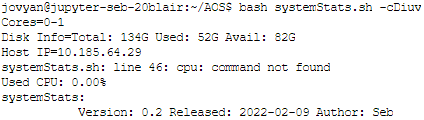
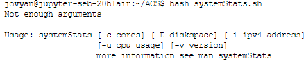

# Introduction

So like last week we are going to keep adding to our script we created
using on JupyterHub.

>**NOTICE**
>
> Jupyterhub link here: <https://jupyterhub.canterbury.ac.uk/>
>
>1.   Sign in with your CCCU Microsoft account.
>
>2.  In launcher menu click Terminal and Bash
>
>3.  Once in terminal mode, either make a directory () called 'AOS' or  navigate to it if you did this last
time ().
>
>4.   Now create a file called with by writing into the terminal , if you  already have a from last week do
>the following and then .
>

# Front Matter

Once completed the script should output the following information to the terminal, as seen in below.



First of make sure your file looks like code shown below.
```bash
#! /usr/bin/env bash
# CREATED BY: Name
# Date created: todays
# Version 0.1
# this script is designed to gather system statistics
```

In shell scripting comments, where the compiler ignores these lines, is defined as . The first line is special it points to the directive of the
interpreter for the scripting language you are using, in this case ```bash```. We call the ```!#```  a
hash-bang, shebang, hash-pling etc. The idea is it makes the shell script more like an executable file.

# Global Variables

Next we are going to define some variables, in bash all variables are
unless you specify that they are .

```bash
AUTHOR="Seb"
VERSION="0.1"
RELEASED="2022-02-09"
```

Remember that bash is very particular language and whitespaces mean something. So make sure that variable for
example have no spaces. We are going to use these variables later when we call for the version information of the script.

# Usage function

Now we are going to write a function that when called will display a
help message on the terminal about the script, as example see below.



To do this we need to write the following code...

```bash
# Display help message
USAGE(){
  echo-e $1
  echo-e "\nUsage: systemStats [-c cores] [-D diskspace] [-i ipv4 address]"
  echo-e "\t\t   [-u cpu usage] [-v version]"
  echo-e "\t\t   more information see man systemStats"
}
```

Similarly our function name is in upper case as this is global too on line 110. The subsequent lines use the command with to output
information to standard out, or in this case the terminal. When supplied with the argument we enable the use of escape character such as;

>-   ```\n``` new line
>
>-   ```\t``` tab identation

Line 12, means first argument passed into this function. The following lines will print out on a new line
every time the content in side the. This information will tell the user of the script what arguments the
script takes and the arguments descriptions.

# Error Checking

Next we are going to some basic error checking.

```bash
# check for arguments (error checking)
if [ $# -lt 1 ];then
    USAGE"Not enough arguments"
    exit 1
elif [ $# -gt 6 ];then
    USAGE "Too many argurmnets supplied"
    exit 1
elif [[ ( $1 == '-h') || ( $1 == '--help') ]];then
    USAGE "Help!"
    exit 0
fi
```

Conditional checks can be performed in many styles within bash, here we see two styles.

Firstly, ```[ ]```, is the same as the *built-ins* ```test``` command. It supports single conditional checks,
and subsequent checks must be performed in separate brackets, separated by Boolean operators, ```&&``` and
``||`` doesn't support the NOT (```!```) operator. To invert a condition, use a ```!```  outside the first
bracket to use the shell's facility for inverting command return values.

Secondly, line 24, ```[[ ]]``` is bash-specific, though others shells may have implemented similar
constructs. The operators ```==```  and ```!=```  apply bash pattern matching rules, see **Pattern Matching**
in ```man```. ```bash``` has a ```=~``` regex match operator allows use of parentheses and the ```!```,
``&&`` and ``||`` logical operators within the brackets to combine subexpressions.

So back to lines 18 and 21 check to see if the length of arguments,```$#``` , is less than,```-lt```  and a
separate check for greater than, ```-gt```.

Line 24, shows we are checking for a match in patterns that are not numeric. So the conditional check is
comparative to see if ```$1``` matches either ```-h``` or ```--helpS``` .

Also, notice how we are using , which indicates an error.

>**WOULD YOU LIKE TO KNOW MORE...?**
>
>- Exit code 0 Success
>
>- Exit code 1 General & miscellaneous errors, such as *divide by zero*
>
>- Exit code 2 Misuse of shell built-ins Example: ```empty_function()```


# The Arguments

Remember earlier when we typed out the we added information about our
arguments for this script? Well now are going to do this and use another
function for bash called as seen on line 31.

>**WOULD YOU LIKE TO KNOW MORE..?**
>
>- ```getopts``` processes the positional parameters of the parent command. In bash, this is stored in the
>shell variable.
>
>      ```mycmd -a argument1 -b argument b ```
> - During the time that ```mycmd``` is running, the variable ``$``contains the string ```-a argument1 -b
> argument2``` .
> You can use```getopts``` to parse this
> string for options and arguments.


```bash
while getopts cDiuv OPTION
do
case ${OPTION}
in
c) CORES=$(cat /sys/devices/system/cpu/present)
   echo"Cores="${CORES};;
D) DISKSPACES=$(df -H  | grep -w'overlay'| awk'{print "T: "$2 " U: "$3 " A: "$4}')
   echo-e "Disk Info="${DISKSPACES};;
i) IP=$(hostname -I)
   echo"Host IP="${IP};;
u) tmp=$(grep -w'cpu'/proc/stat)
   USAGE=$(${tmp}| awk'{(usage=($2+$3+$4+$6+$7+$8)*100/($2+$3+$4+$5+$6+$7+$8))}
                      {free=($5)*100/($2+$3+$4+$5+$6+$7+$8)}
                      END {printf " Used CPU: %.2f%%",usage}
                          {printf " Free CPU: %.2f%%",free}'
   echo-e ${USAGE};;
v) echo-e "systemStats:\n\t\tVersion:${VERSION} Released:${RELEASED} Author:${AUTHOR}";;
*) USAGE "Option not recognised"
esac
done
```

Breaking down this codes:

-   Line 31, use the ``while`` construct to iterate over all arguments supplied  via the scripts invocation.
    Where the inputs are matched against those specified as argument to ``getopts`` the ```OPTION``` variable
    stores the first or current argument supplied by the user, and then proceeds to the next one once the
    ```case``` has been matched.

-   Line 33, shows the bash syntax for a ```switch\case```statement, like you might have seen in ```.NET```

-   Line 35. is executed when ```OPTION == 'c'```. Remember that ```cat``` is the Linux command for
    concatenating a file for reading or writing to, you can see the expected output of this in the below
    image.


