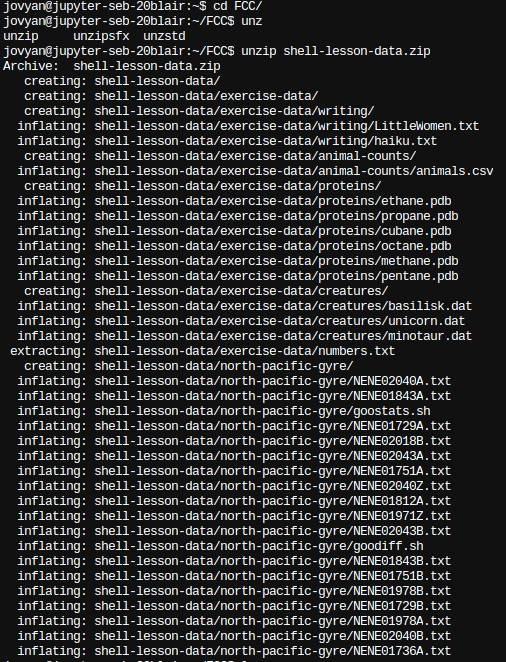

# Installation 

## Downloadable resources/data

Click here to download the [shell-lesson-data](./shell-lesson-data.zip) for the exercises throughout understanding the Shell.

## JupyterHub

1. Navigate to [JupyterHub](https://jupyterhub.canterbury.ac.uk/) 
   - an online environment where you can code and explore the Shell.
>>
2. Login to [JupyterHub](https://jupyterhub.canterbury.ac.uk/) using your CCCU user account credentials.
>>
3. Start your server... 
   >>
   
>>
4. Once server has started <kbd>Right Click</kbd> File Browser view and create a new folder called `FCC`
>>
5. <kbd>Double Click</kbd> `FCC` and select the upload files icon to upload the `shell-lesson-data.zip`. Alternatively you can drag the `shell-lesson-data.zip` from your host machine to the file browser in jupyter hub to upload it. 
>>
6. Next select from the `Launcher` window the 'Terminal' icon to load a terminal. 
   >>
    
>>
7. Now you can navigate to the correct directory using the following commands, note we will be going over what these mean at a later date. 
   ```bash
   cd FCC
   ```
   ```bash
   unzip shell-lesson-data.zip && rm shell-lesson-data.zip 
   ```
   You should see something like this on your terminal...
   >>
   
>>
8. Ok good job, you are ready for lab exercises. 
   
[Back to Contents Page](shell.md)